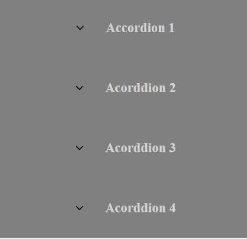

## Instalando Dependências

```bash
npm install
# or
yarn
```

## Iniciando LocalHost

Primeiro, inicie o servidor com os seguintes comandos em seu terminal:

```bash
npm run dev
# or
yarn dev
```

Abra [http://localhost:3000](http://localhost:3000) no seu navegador para ver o resultado.

<h1 align="center">
  { Accordion ReactJS }
</h1>

<p align="center">
  <a href="#-tecnologias">Tecnologias</a>&nbsp;&nbsp;&nbsp;|&nbsp;&nbsp;&nbsp;
  <a href="#-projeto">Projeto</a>&nbsp;&nbsp;&nbsp;|&nbsp;&nbsp;&nbsp;
</p>

<br>

<p align="center">
  
</p>

## 🚀 Tecnologias

Esse projeto foi desenvolvido utilizando:

- ReactJS
- StyledComponents

## 💻 Projeto

Esse projeto foi desenvolvido com o intuíto de aprender como criar um componente que tem seu estado manipulado pelo index.
